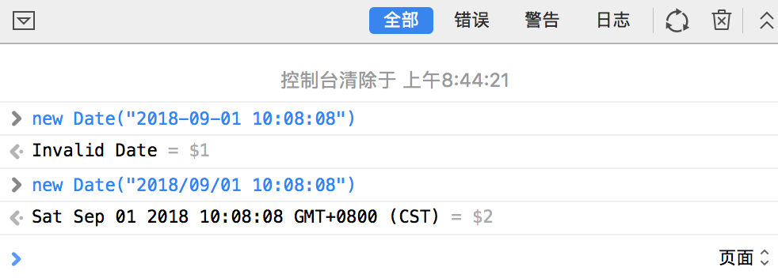

# 遇到过的Issue <Badge text="0.10.1+" type="tip"/>

### 雪碧图可以避免图片加载慢造成的hover闪烁效果
做过一次tab选项卡，显示图片的，看谷歌的时间线，图片加载过慢，导致选项卡都切换成功了，图片闪动的出现在了屏幕上,解决方案最后用的雪碧图
```css
$img-width: 24px;
$img-height: 24px;
$bgImg: image-url('toolbar.png');
@media-img {
  background-image: $bgImg;
  background-position: -($img-width * 5) -($img-height * 1);
  width: $img-width;
  height: $img-height;
}
```

### JS IOS/iPhone的Safari不兼容Javascript中的Date()问题
上图

如图所示，上次后端返回第一种格式，safari浏览器invalid，查了一下[ECMA](http://ecma-international.org/ecma-262/5.1/#sec-15.9.1.15),更改如下:
```js
var dateString = "2018-12-31 00:00:00";
var d = new Date(dateString.replace(' ', 'T'));
// 或
var d = new Date(dateString.replace(/-/g, '/'));
```
**这两种情况的容错判断要记得加，若后端返回空，容易报错**,最好的解决办法直接用[date-fns](https://date-fns.org/)


### vue中的tab切换和unwatch解决重复http请求
问题描述：vue中`SPA`模式下的，三个选项卡，分别对应三个select（一共9个）来进行列表查询，查询条件被vue，listen，然后getlist。切换tab的首次来获取后端返回的`droplist`来进行select渲染，这时候会遇到多次http请求的情况，因为listen到了多次变化。
解决方案就是利用vue的`unwatch` api
```js
//监听条件列表
const statusSet = new Set();
const statusArr = ["param1", "param2", "param3", "param4"];
//fire函数
function initWatchers() {
  statusSet.clear();
  statusArr.forEach((i, index) => {
    this.$nextTick(function() {
      statusSet.add(this.$watch(i, val => val !== null && this.getList()));
    });
  });
}
created(){
    // fire them
    initWatchers.call(this);
}
//methods中
changeTab(){
    // unwatch
    statusSet.forEach(fire => fire());
    //...处理droplist,并且赋值status初始值
    //然后继续fire
    initWatchers.call(this);
}
```
### 后端返回列表后数据格式化处理较为繁琐

```html
//before
<el-table-column label="充值" prop="save" :formatter="formatter1"/>
<el-table-column label="活动" prop="event" :formatter="formatter2"/>
<el-table-column label="时间" prop="time" :formatter="formatter3"/>
```
总不能命令后端更改返回格式吧，前端来处理吧！
```js
//写在vue中或者mixin中，reuse也可以
format = ({save, ...props}) => ({saveVal: mat(save), ...props})
//use in list
let list = await axiosPlus(url, parObj).data.users;
list.map(_ => ({
    ...(this.format?this.format(_):_)
}))
```
