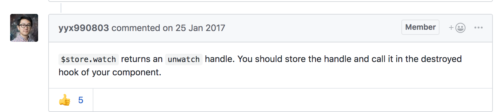

## 如何在vue中remove一个watcher
[issue](https://github.com/vuejs/vuex/issues/599),发生了内存泄漏。作者是这么回答的：


先熟悉一下vue中如何使用watch监听多个查询条件的变化，callback写getList;

```js
//.vue组件中使用一个listen函数
this.listen()
//mixin中定义listen方法,默认参数了解一下~
listen(prop = []){
    this.$nextTick(() => {;
        (Array.isArray(prop) && prop.length ?
          prop : ['queryParam1', 'queryParam2'].concat(prop)
        )
        .forEach(i =>
          this.$watch(
            i,            
            val => val !== null && !this.resetting&&this.get()            
          )
        )
      })
}
```

::: tip
you can actually watch computed properties too, and not just data properties.
:::
再看下store中的watch:
```js
 this.$store.watch((state, getters) => getters.loading, () => {
    console.log('loaded')
    console.log('onSIgnin error', this.error.code)
})
```
那么有些场景你可能不需要watch了，这时候就要把watch注销掉,vuetify中大量使用了unwatch，写法如下:
```js
created() {
   var unwatch = this.$watch(....)   
   //now the watcher is watching and you can disable it
   //**你可以把unwatch存在任何地方**，调用，watch就会被remove;
   //一般是在组件destroy的时候remove   
}

```

有时间欣赏一下vuetify的源码吧。