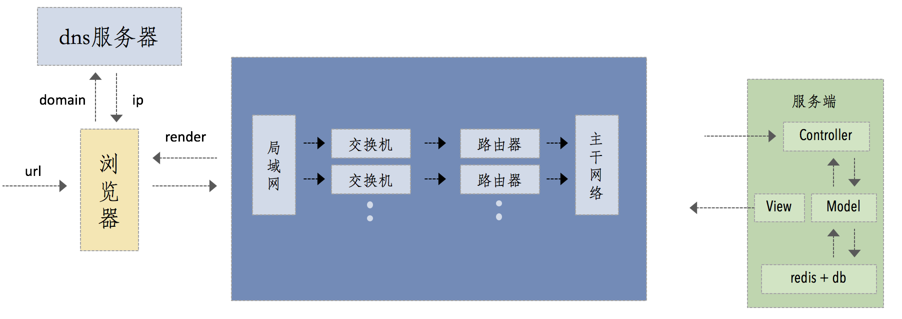
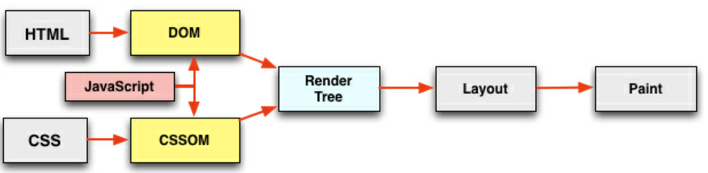
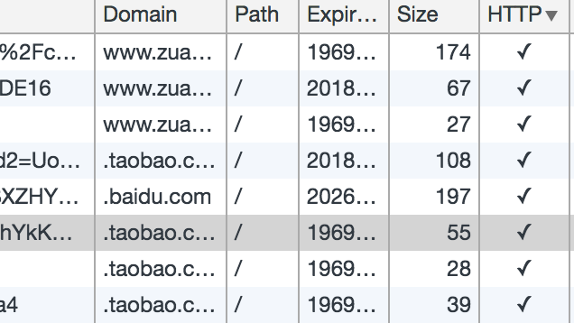
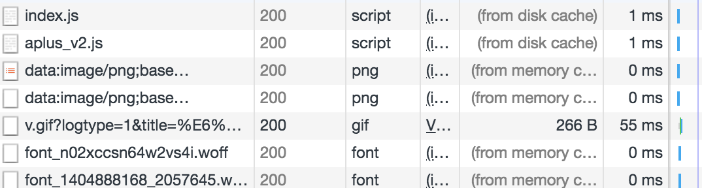

# Web性能优化
## 资源的合并与压缩
先看下http请求过程

`html`压缩，`css`压缩，`js`的压缩和合并(不仅缩减，还会代码保护)，开启gzip不多说，`webpack`解决，说下注意事项，`业务代码要和公共代码分开合并`，不然开发时，发布的压缩后的代码，用户还要重新缓存一遍。详情见这篇[blog🚀](https://webkws.github.io/nicolas_blog/blogs/webpack.html)
## 图片相关的优化
#### `png8/png24/png32`之间的区别 
* png8 —— 256色 + 支持透明
* png24 —— 2^24色 + 不支持透明
* png32 —— 2^24色 + 支持透明 
#### 针对不同的业务场景选择不同的格式
* jpg有损压缩，压缩率高，不支持透明(大部分不需要透明图片的业务场景)
* png支持透明，浏览器兼容好(大部分需要透明图片的业务场景)
* webp压缩程度更好，在ios webview有兼容性问题(安卓全部) 
* svg矢量图，代码内嵌，相对较小，图片样式相对简单的场景(图片样式相对简单)
#### `css sprite` 和`image inline`
雪碧图可以减少http请求次数，image inline小图片直接内嵌到html，base64即可;
#### 矢量图，使用svg，使用`iconfont`解决`icon`问题
#### 最后就是图片的压缩
不多说，nodejs相关工具解决。活动页面可以使用[tinypng🚀](https://tinypng.com/)

## css、js的加载与执行
看一张浏览器加载渲染的图

顺序如下,摘自stackoverflow
* The browser receives the `response`, and `parses` the HTML (which with 95% probability is broken) in the response
* A `DOM tree` is built out of the broken HTML
* `New requests` are made to the server for each new resource that is found in the HTML source (typically images, style sheets, and JavaScript files).
* Go back to http request 
* `Stylesheets` are parsed, and the rendering information in each gets attached to the matching node in the DOM tree
* `JavaScript` is parsed and executed, and DOM nodes are moved and style information is updated accordingly
* The browser `renders` the page on the screen according to the DOM tree and the style information for each node
 #### html渲染的特点
 * **顺序执行**,每个tag都要从上到下顺序解析。并发加载（所引入的外部资源），因为单个域名的并发请求有限，可以尝试使用3-4个cdn域名
 * **是否阻塞**,css的加载不阻塞外部脚本的加载，但是会阻塞js的执行（有可能js依赖css属性）
 * **依赖关系**,页面渲染依赖于css的加载，css要放在head里,js的执行顺序的依赖关系,js逻辑对于dom节点的依赖关系
 * **引入方式**,link引入css，js也有defer和async
#### 懒加载和预加载
* 懒加载无非就是大多都是图片相关，并发加载的外部资源过多会阻塞js的加载。图片应该在进入可视区后再请求，lazyload，还可以提前placeholder一下比如知乎的手机端，类似这种[content-placeholders](https://github.com/michalsnik/vue-content-placeholders)
* 预加载和懒加载相反，是对资源的提前请求，需要在用户空闲时进行（比如登陆页偷偷的进行），也可以从缓存中加载，提高用户的体验。1、img的display:none不会影响页面的渲染，但是会发送请求，等二次的时候直接从缓存中读取了。2、在js中，new一个Image对象，添加src即可。

## 重绘与回流 <Badge text="0.10.1+" type="tip"/>

因为元素的规模尺寸，布局，隐藏等改变而需要重新构建，称为回流。当`render tree`中的一些元素需要更新属性，而这些属性只是影响元素的外观，风格，而不会影响布局的，比如`background-color`。则就叫称为重绘。UI进程和JS进程互相阻塞，这就是css阻塞js的原因。因为部分css会导致浏览器的重绘和回流。回流必将引起重绘，而重绘不一定会引起回流。

#### 触发页面重布局的属性，大多`structure`
```css
width  height padding margin display border-width border min-height
top bottom left right position float clear text-align overflow-y font-weight
overflow font-family line-height vertival-align white-space font-size
```
#### 只触发重绘的属性,大多`skin`
```css
color border-style border-radius visibility text-decoration background outline-color
outline outline-style outline-width box-shadow
```
#### Chrome创建图层的条件
* 3D或透视变换（`perspective transform`）CSS属性
* 使用加速视频解码的`video`节点
* 拥有3D（`WebGL`）上下文或加速的2D上下文的`canvas`节点
* 混合插件（如`Flash`）
* 对自己的`opacity`做CSS动画或使用一个动画`webkit`变换的元素
* 拥有加速CSS过滤器的元素
* 元素有一个包含复合层的后代节点（一个元素拥有一个子元素，该子元素在自己的层里）
* 元素有一个`z-index`较低且包含一个复合层的兄弟元素（换句话说就是该元素在复合层上面渲染）

在chrome工具栏的layer可以看

#### 实战优化
* 用`translate`替代`top`改变,因为top会触发Reflow
* 用`opacity`替代`visibility`
* 不要一条一条地修改 DOM 的样式，预先定义好 class，然后修改 DOM 的 `className`
* 把 DOM 离线后修改，比如：先把 DOM 给 `display:none `(有一次 Reflow)，然后你修改N次，然后再把它显示出来,不然会多次重绘
* 不要把 DOM 结点的属性值放在一个循环里当成循环里的变量
* 不要使用 `table` 布局，可能很小的一个小改动会造成整个 `table` 的重新布局
* 动画实现的速度的选择
* 对于动画新建图层,动画会触发回流，用新图层较好
* 启用 `GPU` 硬件加速

**以下摘抄自国外某论坛**

* Whenever possible, avoid changing anyformatting after the initial page load.
* Whenever possible, use static CSS instead of dynamic CSS.
* Don’t include CSS rules in the HTTP reply stream if they are not used on the page.
* Use fixed or absolute positioning as much as possible, especially for animations.
* Avoid using HTML tables for layout.
* In animations, reduce the frames per second as much as possible.
* Avoid asking for layout information. If you must, cache the value rather than asking a second time.
* Batch DOM changes and apply them all at once.
* Make changes as low in the DOM tree as possible.
* Keep in mind that HTMLCollection objects rerun a query every time you access them. Whenever possible, cache the HTMLCollection in an array for future use.
* Page zoom affects layout performance. Depending on the browser, resizing the window may also affect layout performance.
* Use as few CSS selectors as you can.
* Avoid universal and multi-class CSS selectors.
* Beware the performance of pseudoselectors.
* Avoid setting multiple inline styles.
* Change class names instead of styles.
* Avoid dynamic styles, but if you must use them, change the cssText property instead of the element’s style property.
* The border-radiusCSS property may be affecting repaint performance more than you think.
* In Internet Explorer, do not use JavaScript expressions within CSS.

查询网址[csstriggers🚀](https://csstriggers.com/) 参考文档[REFLOWS & REPAINTS](http://www.stubbornella.org/content/2009/03/27/reflows-repaints-css-performance-making-your-javascript-slow/)

## 浏览器存储

#### Cookie
因为http是无状态的，所以cookie诞生了，cookie是识别客户端的一个标识。cookie的生成方式，是`http response header`中返回了`set-cookie`，服务端生成，客户端维护，还可以通过js写入,但那只是非httponly的cookie。关于cookie的优化，cookie都会被种在`domain`下，但是并不是所有的请求都需要cookie，比如cdn的域名和主域名要分开，因为静态文件不需要cookie。

**如图所示cookie都被种在了domain下:**


上图HTTP打勾对意思就是HTTPONLY的，不允许js修改。

#### localStorage, SessionStorage, IndexedDB
这俩设计出来就是做浏览器本地存储的。具有不错的api封装，仅在客户端使用。

实战中，可以先从本地读取，后续api请求结束之后再更新它，用户不会感觉到什么。`sessionStorage`可以用作表单的业务，比如：第一页的填写到第二页的填写，然后用户back了，或者是用户突然刷新了。

以上两种对结构化数据来说不太有用，新出了IndexedDB，目前用的不多

## service worker <Badge text="0.10.1+" type="warning"/>
这是一门学问，暂时不会，不多说。

## 缓存
**看一下淘宝首页的Network**:


控制缓存策略的机制，cache-control,它可以存在request header中也可以存在response header中。
分为
```js
//这段时间要用缓存，不会再发请求,它优先级大于expire，status为304
cache-control: max-age=63072000 
//缓存分为 public和private，比如cdn作为中间服务器是public
//s-maxage是public的缓存
//s-maxage优先级大于max-age
cache-control: max-age=2592000,s-maxage=3600
//no-cache是发请求到服务端，然后再根据返回比如lastModified，no-store是不用缓存
cache-control:private, max-age=0, no-cache
//根据last-modified和if-modified来判断 是否需要更新缓存,相比较来看，ETag的哈希值最佳，因为服务器的时间有可能不准
last-modified: Wed, 05 Jul 2017 07:30:08 GMT
```

## SSR
以[vue-ssr](https://ssr.vuejs.org/)为例.随意打开一个SPA的vue网站，清除缓存后，用`performance`刷新发现，很大的时间都在加载js，利用客户端的运算能力，加载和执行vue.js相关代码，而ssr是利用了服务端的运算能力。服务端渲染和客户端渲染要注意平衡，哪一块用SSR，哪一块用Client
