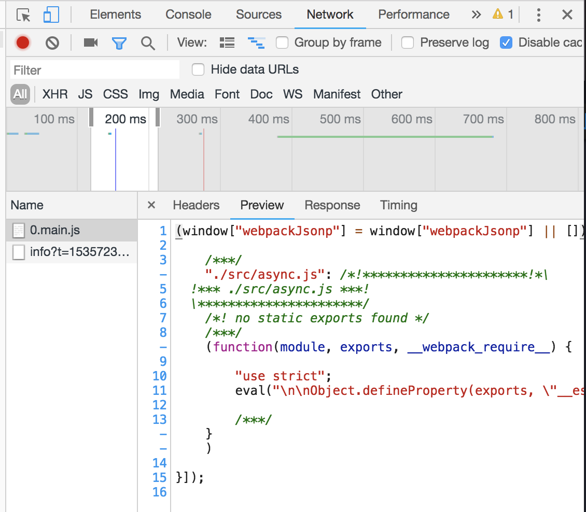

# 由 CommonsChunk 到 SplitChunk

## webpack3中的CommonsChunkPlugin
**先上一套代码:**

```js{2}
//fuck.js
export const fuck = item => item + 2;

//main1.js
import {fuck} from './fuck';
import $ from 'jquery';
console.log($，`first  ${fuck}`);

//main2.js
import {fuck} from './fuck';
import $ from 'jquery';
console.log($，`second ${fuck}`);
```

webpack3 中有一个插件`CommonsChunkPlugin`,打包时可以把多处 import 的模块提取到公共文件，避免重复下载。是用来提取第三方库和公共模块，避免首屏加载的 bundle 文件或者按需加载的 bundle 文件体积过大，从而导致加载时间过长，优化必备。

过程不多说，直接上配置。

```js
new webpack.optimize.CommonsChunkPlugin({
  name: 'vendor',
  minChunks (module) {
    return (        
        module.resource &&
        /\.js$/.test(module.resource) &&
        module.resource.indexOf(
        path.join(__dirname, '../node_modules')
        ) === 0
    )
    }
}),
new webpack.optimize.CommonsChunkPlugin({
    name: 'manifest',
    minChunks: Infinity
}),
new webpack.optimize.CommonsChunkPlugin({
    name: 'app',
    async: 'vendor-async',
    children: true,
    minChunks: 3
}),
```

有一点需要注意，`[hash]`适用于开发环境，每次编译都会改变，而`[chunkhash]`适用于生产环境，为了迎合浏览器的缓存机制。所以在生产环境，output 的:
`chunkFilename: utils.assetsPath('js/[id].[chunkhash].js')`

 * 第一个配置，minChunks的规则是:
`minChunks: number|Infinity|function(module, count) => boolean`
使用上述函数的写法保证了vendor中,只保留第三方库。而不会把runtime webpack运行时的代码包括进去，因为不把`runtime`剥离出来，本地的代码一旦改变，无论引用的第三方库改不改变，`vendor`都会变，那样的话生产环境浏览器会再次加载。
* 再说第二个配置`mainfest`:
用来引导所有模块的交互。manifest文件包含了加载和处理模块的逻辑，有了它，runtime会根据manifest文件来处理和加载模块
* 再说第三个配置`async`和`children`的使用方法:
  包含require.ensure,AMD,import()
```js

#1:[]中是依赖，callback中写入require的东西，最后一个参数是output的chunkFilename
require.ensure([], function(require){
    require('./first.js');
},'name');
#2:返回一个promise
import('./async.js).then((data)=> ... )
```
* Lazy Loading，懒加载或者按需加载，属于code split的一部分。当chilren为true的时候，`source chunk`通过`entry chunks`进行code split,children 可以用来把 `entry chunk` 创建的 `children chunks` 的共用模块合并到自身，但这会导致初始加载时间较长.async就解决了children:true时合并到`entry chunks`自身时初始加载时间过长的问题，async设为true时，`commons chunk` 将不会合并到自身，而是使用一个新的异步的`commons chunk`。当这个`children chunk` 被下载时，自动并行下载该`commons chunk`。具体的分析可以看[这里](http://qiutianaimeili.com/html/page/2018/06/d348hdviz3w.html)
* chunk分为async和sync
>Async chunks are loaded on demand (lazy loaded) and you would see network request for async chunk files in developers tool.
  
## webpack4中的SplitChunkPlugin

::: tip webpack文档中有这么一句话
Originally, chunks (and modules imported inside them) were connected by a parent-child relationship in the internal webpack graph. The CommonsChunkPlugin was used to avoid duplicated dependencies across them, but further optimizations were not possible.
:::

每次切割之后，生成一种父子关系，更深一步的优化还是要靠SplitChunkPlugin

<!-- [这篇以react为例子的SplitChunkPlugin用法写的不错](https://itnext.io/react-router-and-webpack-v4-code-splitting-using-splitchunksplugin-f0a48f110312)
 -->
 借用老外的一篇文章把chunk分为了三种：

* **Vendor Chunk** Create separate files for `vendor code` (3rd party code coming from `node_modules`). A single vendor.js file will suffice. Any vendor code used inside `index.js` (`import` statements of `npm` modules) will be break from it and form `vendor.js` which will be loaded synchronously with `main.js`.
  
* **Async Chunks** Create separate files for code which can be lazy loaded. Like a file for every `Route of React router` which can be **lazy loaded when route is changed**. Webpack inject some code into `main.js` which takes care of lazy loading async chunks and stops from loading same chunks again and again. When route changes, React router calls a Webpack function to load a chunk file and Webpack after done loading runs it, which chunk would internally ask React to do something.
  
* **Common Chunk** Create common file from code which is shared between different chunks. For example, if 10 routes create 10 different async chunks and these chunks have a common `import` statement, then code associated with that `import` statement will get injected into respective chunk files separately. That would load same piece of code every single time we change the route, which is not a very good for UX. Instead, we could take out common code shared between different chunks and create `common.js` file which will be loaded synchronously with main.js beforehand.

### webpack's import
webpack自带import(module)来处理异步，返回一个promise，这个module可以是npm也可以是本地的模块
```js
//async.js
export default 'fuck';

//index.js
import('./async.js').then( data => {
    console.log(data)
})

```
这一步会报错，因为它和es6的`import`冲突了,需要安装`babel-plugin-syntax-dynamic-import`;
然后运行，看时间线，会发现`0.main.js`是异步加载的,这里就包含了async.js中所有export出的value



### 接下来说import()和vue-router

```js
<BrowserRouter>
    <div>
        <div className="menu">
            <Link exact to="/" activeClassName="active">Home</Link>
            <Link to="/about" activeClassName="active">About</Link>
            <Link to="/contact" activeClassName="active">Contact</Link>
        </div>
        
        <Switch>
            <Route exact path="/" component={ HomeComponent } />
            <Route path="/about" component={ AboutComponent } />
            <Route path="/contact" component={ AsyncContactComponent } />
        </Switch>
    </div>
</BrowserRouter>
```
代码所示，contact对应的路由，prop传递一个异步组件,我们现在来模拟一下异步加载。
```js
// yarn add react-loadable -S 满足异步组件之前可以显示loading

import loadable from 'react-loadable';

const LoadingComponent = () => <h3>please wait...</h3>;

const ContactComponentPromise = () => import('./ContactComponent');

const AsyncContactComponent = loadable({
    loader: ContactComponentPromise,
    loading: LoadingComponent
})

```
然后观察时间线，或者页面的表现，会发现1.main.js是异步加载的

### 下面说SplitChunksPlugin的配置

```js
splitChunks: {
    chunks: "async",//有all, async, and initial 还可以写函数retrun
    // chunks(chunk){
    //     return chunk.name !== 'my-excluded-chunk'
    // }
    minSize: 30000,
    minChunks: 1,//共享该module的最小chunk数
    maxAsyncRequests: 5,
    maxInitialRequests: 3,
    automaticNameDelimiter: '~',
    name: true,
    cacheGroups: {
        vendors: {
            test: /[\\/]node_modules[\\/]/,
            priority: -10
        },
    	default: {
            minChunks: 2,//共享该module的最小chunk数
            priority: -20,//优先级
            reuseExistingChunk: true
        }
    }
}
```

[参考文献1](https://itnext.io/react-router-and-webpack-v4-code-splitting-using-splitchunksplugin-f0a48f110312)
[参考文献2](https://juejin.im/post/5af15e895188256715479a9a)