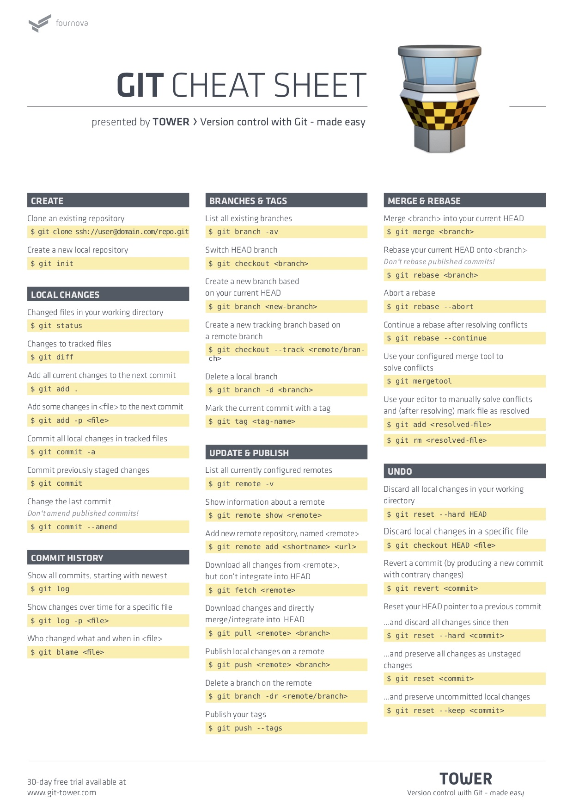
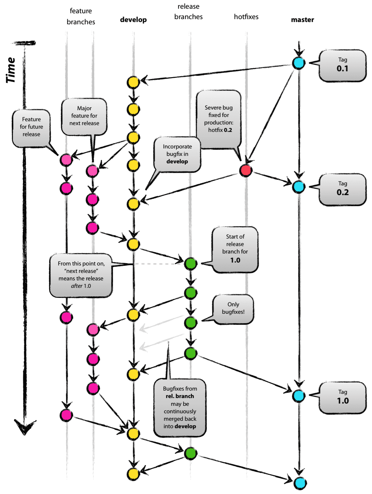

# About Git

## 用起来不错的Git项目 <Badge text="0.10.1+" type="tip"/>
* [shvl](https://github.com/robinvdvleuten/shvl) shvl
* [bulma](https://github.com/jgthms/bulma) 基于flex的css框架
* [clipboard](https://github.com/zenorocha/clipboard.js) 不需要flash做到原生app的复制功能
* [vuex-persistedstate](https://github.com/robinvdvleuten/vuex-persistedstate) vuex的持久化方案
* [luhn.js](https://gist.github.com/ShirtlessKirk/2134376) 银行卡验证方案
* [vue-data-tables](https://github.com/njleonzhang/vue-data-tables) 基于element的可定制的分页表格
* [vue-awesome](https://github.com/vuejs/awesome-vue) vue的生态
* [vue-multiselect](https://vue-multiselect.js.org/) Vue的下拉组件
* [vuex-router-sync](https://github.com/vuejs/vuex-router-sync) router和store同步
* [qrcode](https://github.com/davidshimjs/qrcodejs) 二维码js生成器
* [Antv](https://github.com/antvis/g2/) 数据可视化,手机端不错
* [anime.js](https://github.com/juliangarnier/anime) 文字动画特效库
* [dragscroll](https://github.com/asvd/dragscroll) 浏览器scrollbar解决方案
* [date-fns](https://github.com/date-fns/date-fns) 和时间格式化相关的库 [moment](https://github.com/moment/moment)
* [vConsole](https://github.com/Tencent/vConsole/blob/dev/README_CN.md) 手机网页的前端开发者调试面板
* [nuxt-koa](https://github.com/nuxt-community/koa-template) 手机网页的前端开发者调试面板
* [popmotion](https://github.com/Popmotion/popmotion) js运动引擎，可以用来实现动画，物理效果和输入跟踪
* [vue-content-placeholders](https://github.com/michalsnik/vue-content-placeholders) 加载网页的占位特效, [原理](https://cloudcannon.com/deconstructions/2014/11/15/facebook-content-placeholder-deconstruction.html)
* [bundle-analyzer](https://github.com/webpack-contrib/webpack-bundle-analyzer) webpack的bundle可视化 vue-cli自带,npm run build --analyze

## git的操作 <Badge text="0.10.1+" type="warn"/>
回退某个文件的版本然后强制提交: 
```
#这种操作git reflog才可以看到记录,GUI或者git log看不到
git checkout  版本号 文件名
git push -f
```

[Git教程](https://www.liaoxuefeng.com/wiki/0013739516305929606dd18361248578c67b8067c8c017b000)以及[避免使用git pull](https://coderwall.com/p/jgn6-q/git-pull-is-evil)

[git rm --cached](https://stackoverflow.com/questions/25436312/gitignore-not-working/25436481) git cached导致的ignore无法忽略已提交目录

[Git flow工作流](https://www.git-tower.com/learn/git/ebook/cn/command-line/advanced-topics/git-flow)和
[最佳实践](https://www.cnblogs.com/cnblogsfans/p/5075073.html)

### Git cheatsheet :tada:


### Git flow :100:

